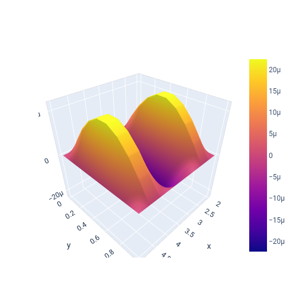

## Portfolio

---

### My Projects

[Image Quality Enhancement with Neural Network ](https://github.com/marianna13/Notebooks/blob/master/CNN%20Improve%20Image%20Quality.ipynb)

[HeatPy is the Python package for simulating heat](https://github.com/marianna13/heatpy)

---

[Visualization of Hydrogen-like atoms](https://github.com/marianna13/Notebooks/blob/master/Hydrogen.ipynb)

---

[Quantum Encryption with Python and ProjectQ](https://github.com/marianna13/Notebooks/blob/master/Quantum_Encryption.ipynb)

---

[Predict Pulsar Stars with XGBoost](https://github.com/marianna13/Notebooks/blob/master/Quantum_Encryption.ipynb)

---

---

